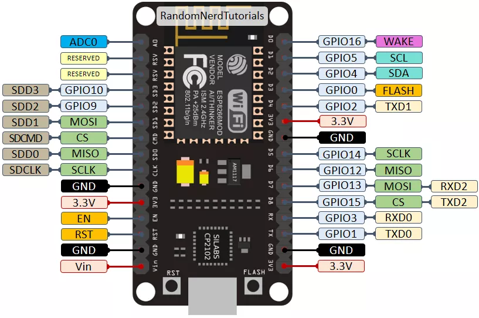
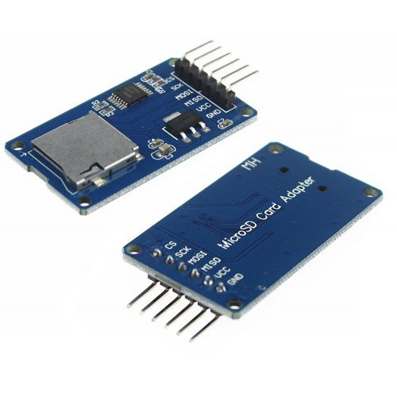
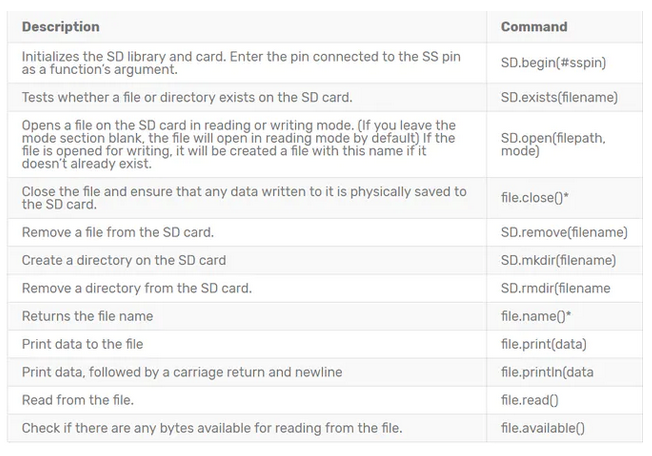

# sd-card-iot

The MicroSD Card Adapter model `CATALEX` is connected with the microcontroller device `NodeMCU 8266` using circuit protocol `SPI`. More details by [`SPI`](https://github.com/sganzerla/embarcados-protocolos-comunicacao/tree/master/`SPI`).

This is the `GPIO` on the board, the connection `SPI` are destacated in color green between pin 12 and 15.

This is the MicroSD model `CATALEX`

This are commands for lib `SD.h`

## Sample Sketch

[Simple Write](./simple-write/README.md)

[Simple Read](./simple-read/README.md)

[Read SdCard Write EPROM](./read-sd-card-write-eprom/README.md)
