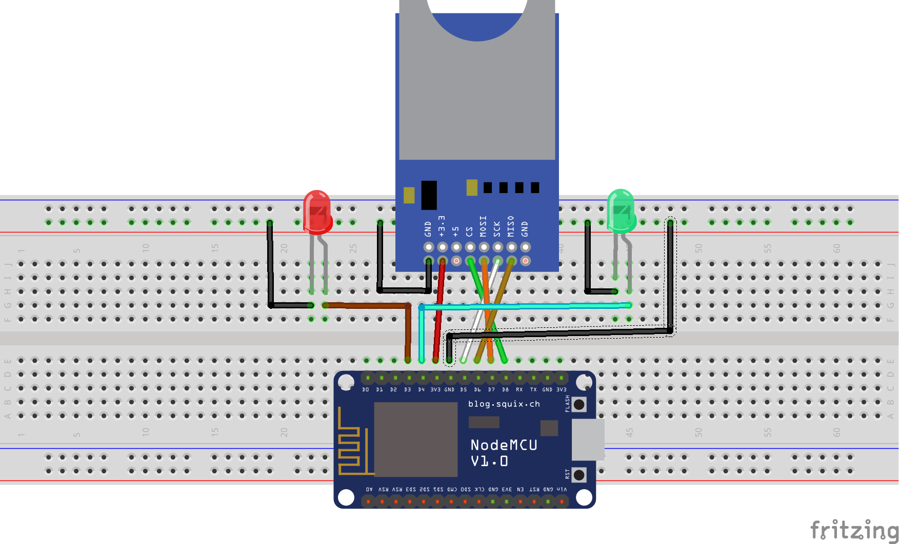

# read-sd-card-write-eprom

This sample code reads the value do `GPIO` of the SD Card with the `CATALEX` adapter model and is stored in `EPROM` memory if is not equal.

Since this type memory is not volatile, the SD Card can be removed because the values has storeded in the `EPROM`.

The setup reads number `GPIO` pin in address `EPROM` 0 for write `HIGH` value.

## Circuit

NO SD CARD: LEDS OFF.
SD without file color.txt: LEDS OFF.
SD with file color.txt and numer 2: LED RED ON.
SD with file color.txt and numer 0: LED GREEN ON.
SD without file color.txt: LED GREEN ON.
NO SD CARD: LED GREEN ON.
